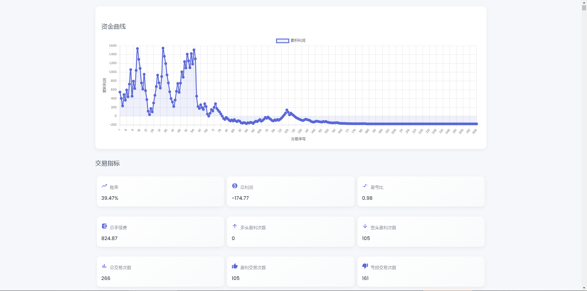
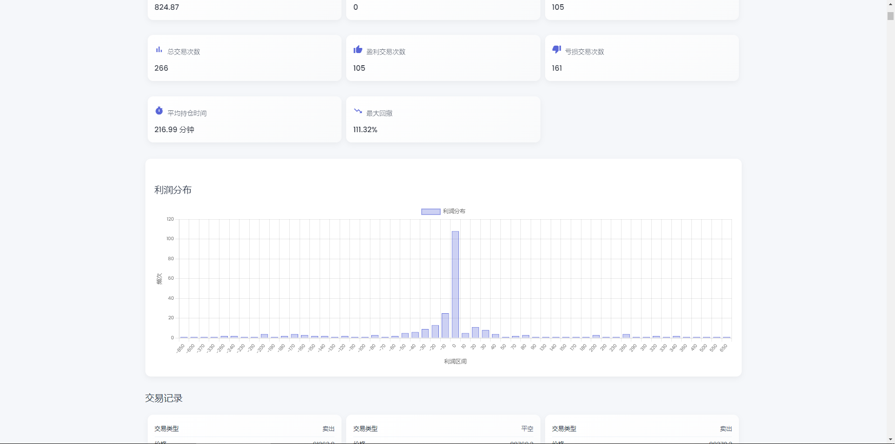
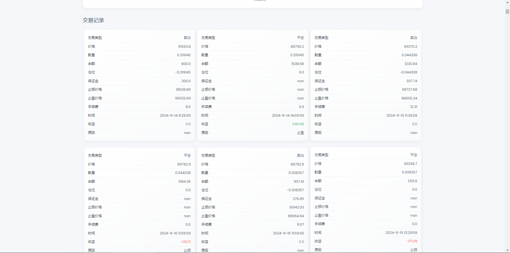

## Introduction  
`backtrader_coin` is a self-developed cryptocurrency backtesting framework. Its core modules include `FakeBroker` (simulated trading), multiple built-in strategies (dual moving average, Bollinger Bands, ATR, etc.), and a Web UI for result visualization. Future plans include integrating Binance for live trading (under development), while currently focusing on efficient backtesting and strategy development.  

   
  

## Features  
- **Custom Backtesting Engine**: Simulates trading with `BacktestEngine` and `FakeBroker`, supporting customizable initial capital, leverage, fees, stop-loss, take-profit, etc.  
- **Multiple Strategies**: Built-in strategies include dual moving averages, Bollinger Bands + RSI, ATR, and more. Custom strategies are also supported.  
- **Data Support**: Fetch K-line data from Binance (or other sources).  
- **Web UI Visualization**: Displays backtesting results in a web interface, including equity curves, trade records, etc.  
- **Future Plans**: Integration with Binance for live trading (under development).  

## Installation  
1. Ensure you have Python 3.6+.  
2. Clone the repository:  
    ```bash  
    git clone https://github.com/icebear-qaq/backtrader_coin.git  
    cd backtrader_coin  
    ```  
3. Install dependencies:  
    ```bash  
    pip install -r requirements.txt  
    ```  
   (If `requirements.txt` is missing, it's recommended to manually install `pandas`, `numpy`, `requests`, `flask`, etc.)  

## How to Use  
Open `main.py` to check usage details.  

## How to Use AI to Write and Backtest Strategies  
Want to create your own strategy? AI (such as ChatGPT) can help. Follow these steps:  
1. Go to `coin/strategy/` and copy an existing strategy file.  
2. Paste the code into an AI model and describe your desired strategy.  
3. Save the AI-generated strategy in the `coin/strategy/` folder, e.g., `macd.py`, then call it in the main program:  
    ```python  
    strategy = MACDStrategy()  
    engine = BacktestEngine(broker, strategy)  
    engine.run(data)  
    ```  

## Contribution  
Feel free to open an issue or submit a PR! Reach out on GitHub if you have any questions.  

## Final Note  
If you find this project useful, consider giving it a star! ⭐
